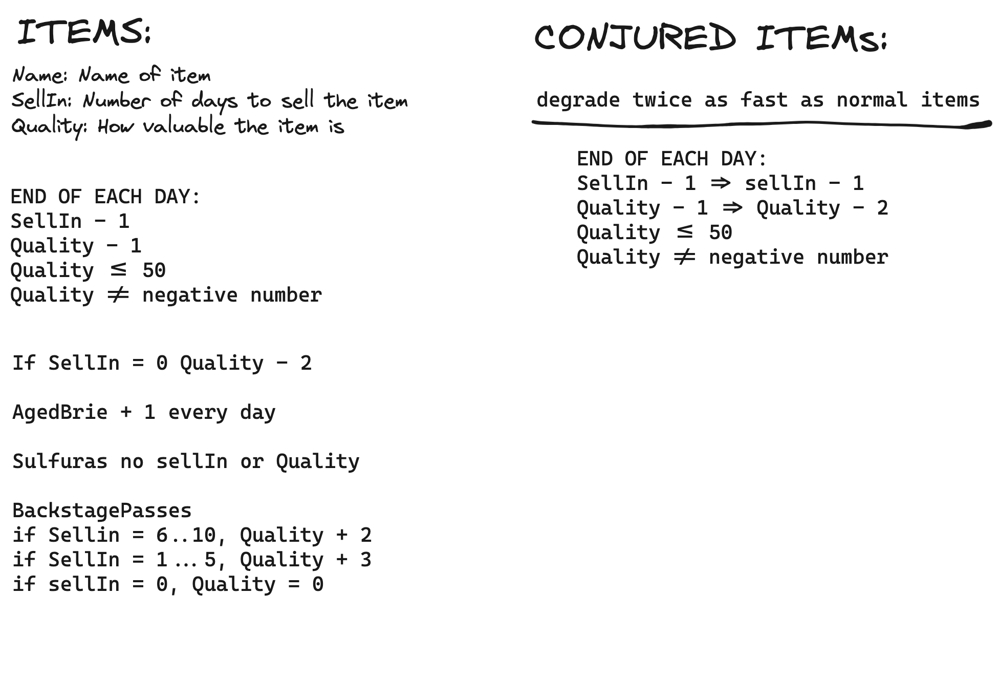
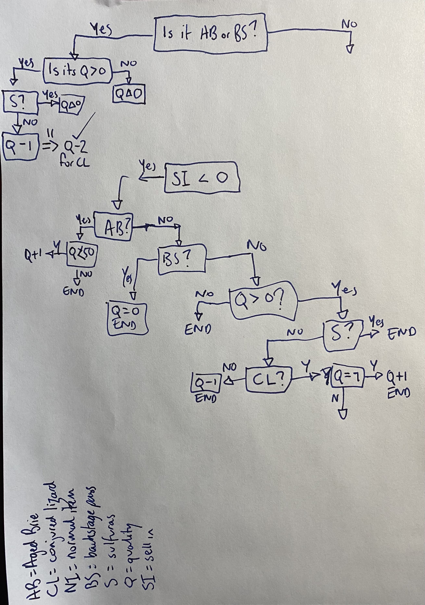

# Gilded rose tech test

#  Intro and reflections

  This was an afternoon challenge to complete the gilded rose tech test. I used javascript as the language and jest as my testing framework. Building a solid test suite allowed me to alter the code without unwittingly breaking the legacy code. This was a good lesson in how to get to grips and quickly understand legacy code and implement changes that do not affect the rest of the function. I tried to alter as little as possible and always used my tests to check that nothing was harming the outcome.

  Given more time I would have liked to analyse how to refactor the code so that the long if statements in the main function may be transformed for easier readability.

## The brief:

Choose [legacy code](https://github.com/emilybache/GildedRose-Refactoring-Kata) (translated by Emily Bache) in the language of your choice. The aim is to practice good design in the language of your choice. Refactor the code in such a way that adding the new "conjured" functionality is easy.

You don't need to clone the repo if you don't want to. Feel free to copy [the ruby code](https://github.com/emilybache/GildedRose-Refactoring-Kata/blob/main/ruby/gilded_rose.rb) into a new folder and write your tests from scratch.

HINT: Test first FTW!

# Screenshots of diagram planning

This is a well known kata developed by [Terry Hughes](http://iamnotmyself.com/2011/02/13/refactor-this-the-gilded-rose-kata/). This is commonly used as a tech test to assess a candidate's ability to read, refactor and extend legacy code.

Here is the text of the kata:

*"Hi and welcome to team Gilded Rose. As you know, we are a small inn with a prime location in a prominent city run by a friendly innkeeper named Allison. We also buy and sell only the finest goods. Unfortunately, our goods are constantly degrading in quality as they approach their sell by date. We have a system in place that updates our inventory for us. It was developed by a no-nonsense type named Leeroy, who has moved on to new adventures. Your task is to add the new feature to our system so that we can begin selling a new category of items. First an introduction to our system:

All items have a `SellIn` value which denotes the number of days we have to sell the item. All items have a Quality value which denotes how valuable the item is. At the end of each day our system lowers both values for every item. Pretty simple, right? Well this is where it gets interesting:

- Once the sell by date has passed, Quality degrades twice as fast
- The Quality of an item is never negative
- “Aged Brie” actually increases in Quality the older it gets
- The Quality of an item is never more than 50
- “Sulfuras”, being a legendary item, never has to be sold or decreases in Quality
- “Backstage passes”, like aged brie, increases in Quality as it’s `SellIn` value approaches; Quality increases by 2 when there are 10 days or less and by 3 when there are 5 days or less but Quality drops to 0 after the concert

We have recently signed a supplier of conjured items. This requires an update to our system:

* “Conjured” items degrade in Quality twice as fast as normal items

Feel free to make any changes to the `UpdateQuality` method and add any new code as long as everything still works correctly. However, do not alter the Item class or Items property as those belong to the goblin in the corner who will insta-rage and one-shot you as he doesn’t believe in shared code ownership (you can make the `UpdateQuality` method and Items property static if you like, we’ll cover for you)."*